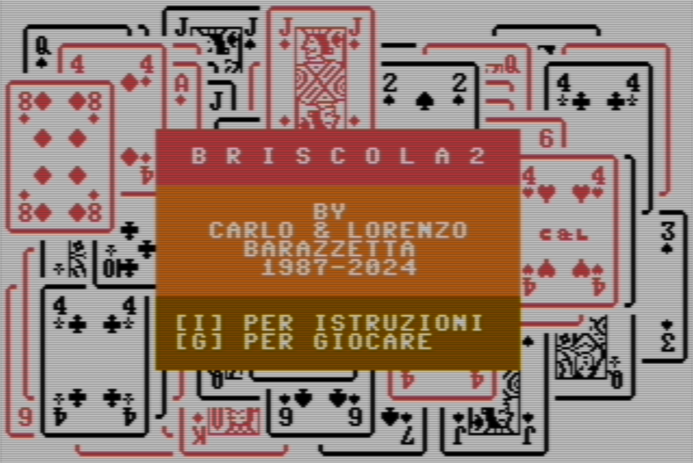
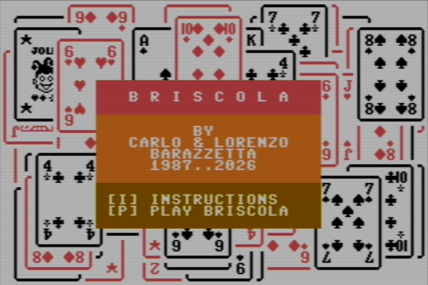
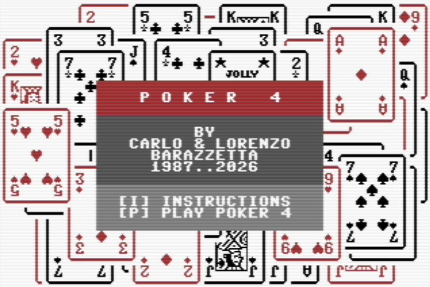

🇬🇧 [English](README.md) | 🇮🇹 **Italiano**

# PROGRAMMA "CARD" PER COMMODORE 64 - BASIC V2 [](https://opensource.org/licenses/Apache-2.0)

---
### A COSA SERVE IL PROGRAMMA "CARD"
Il programma **CARD** serve per sviluppare giochi con le carte con il Commodore 64.

Il comando CARD estende il BASIC V2 per poter stampare le carte da gioco sullo schermo.

Le carte sono visualizzate con simboli grafici ridefiniti.

E' possibile visualizzare ogni tipo di carta in ogni parte del video.


_Nell'immagine un esempio di carte da gioco stampate in modo "random" come sfondo iniziale del gioco "Briscola" scritto in BASIC sfruttando il programma CARD._

Nel 1985 Carlo e Lorenzo Barazzetta hanno sviluppato la libreria "CARD", con la quale hanno poi sviluppato 3 giochi, pubblicati da Systems Editoriale negli anni seguenti:

Link ai 3 giochi originali degli anni 80:

- [Black Jack (1986) in formato D64](BlackJack.D64)
- [Black Jack (1986) in formato Snapshop per Vice C64 Emulator](BlackJack-vice-snapshot.vsf)
- [Briscola (1987) in formato D64](./Briscola.D64)
- [Briscola (1987) in formato Snapshop per Vice C64 Emulator](./Briscola-vice-snapshot.vsf)
- [Poker 4 (1987) in formato D64](./Poker4.D64)
- [Poker 4 (1987) in formato Snapshop per Vice C64 Emulator](./Poker4-vice-snapshot.vsf)

---


_Nell'immagine la schermata iniziale di Black Jack._

---

Il gioco di Poker 4 mostrava anche una "copertina" ed aveva una caratteristica unica tra i giochi di carte, ovvero la possibilità di giocare contro 3 computer, con "personalità" diverse.


In questo repository trovate i 4 file dei giochi (in formato D64 e Snapshot per Vice C64 Emulator) e il manuale per programmare altri giochi in BASIC.

---
## BRISCOLA 2 - 2024

Il gioco della Briscola originale è stato aggiornato nel 2024, con queste nuove funzionalità:

- il giocatore umano ed il computer, all'inizio di ogni partita, iniziano a turno a giocare la prima carta (chi inizia a giocare nella prima partita è casuale).
- modificate le istruzioni del gioco per renderle più leggibili
- modificato il codice BASIC per renderlo più leggibile
- il puntaggio finale viene mostrato per un tempo più lungo
- corretto un bug nell'IA



_Nell'immagine lo splash screen iniziale del gioco "Briscola 2" aggiornato nel 2024._

Puoi scaricare i files:
- [Briscola 2 (2024) in formato D64](./Briscola2.D64)
- [Briscola 2 (2024) in formato Snapshop per Vice C64 Emulator](./Briscola2-vice-snapshot.vsf)

---
## BRISCOLA IN INGLESE - 2026

Nel 2026, il gioco Briscola 2 è stato tradotto in inglese, e ulteriormente corretto.



_Nell'immagine lo splash screen iniziale del gioco "Briscola" tradotto in inglese nel 2026._

Puoi scaricare i files:
- [Briscola italiano (2026) in formato D64](./Briscola-it.D64)
- [Briscola italiano (2026) in formato Snapshop per Vice C64 Emulator](./Briscola-it-vice-snapshot.vsf)
- [Briscola inglese (2026) in formato D64](./Briscola-en.D64)
- [Briscola inglese (2026) in formato Snapshop per Vice C64 Emulator](./Briscola-en-vice-snapshot.vsf)

---
## POKER 4 - NUOVA VERSIONE ITALIANA E INGLESE - 2026

Nel 2026, il gioco originale Poker 4 (1987) è stato rivisto e tradotto in inglese.

Le nuove versioni italiana e inglese includono queste correzioni e miglioramenti rispetto all'originale del 1987:

- corretta la gestione dell'esclusione dei giocatori: i giocatori che restano senza soldi vengono ora correttamente esclusi dalla partita
- corretta la gestione della fine partita: il gioco ora termina correttamente quando rimane un solo giocatore
- simbolo di valuta cambiato dalla Lira (£) all'Euro (€) con nuovo simbolo grafico aggiunto al set di caratteri CARD
- istruzioni del gioco riviste per una migliore leggibilità
- codice BASIC rivisto per una migliore leggibilità



_Nell'immagine lo splash screen di "Poker 4" versione inglese 2026._

Puoi scaricare i files:
- [Poker 4 italiano (2026) in formato D64](./Poker4-it.D64)
- [Poker 4 italiano (2026) in formato Snapshot per Vice C64 Emulator](./Poker4-it-vice-snapshot.vsf)
- [Poker 4 inglese (2026) in formato D64](./Poker4-en.D64)
- [Poker 4 inglese (2026) in formato Snapshot per Vice C64 Emulator](./Poker4-en-vice-snapshot.vsf)

---
## DOCUMENTAZIONE E MANUALI

Nella sezione ["Wiki"](https://github.com/carloBarazzetta/CARD_Games_C64/wiki) trovate il manuale online per utilizzare il programma CARD.

---
## SORGENTI E SVILUPPO

Nella cartella Dev ci sono i sorgenti dei vari progetti realizzati con CARD.

Potete modificare i sorgenti e fare la build dei file .D64 tramite VICE: per usare la vostra versione di VICE dovete correggere il file build-d64.bat alla riga:
```
set VICE_DIR=D:\App\GTK3VICE-win64\bin
```
Buon divertimento.

### Copyright © 1985-2026 - Carlo & Lorenzo Barazzetta
