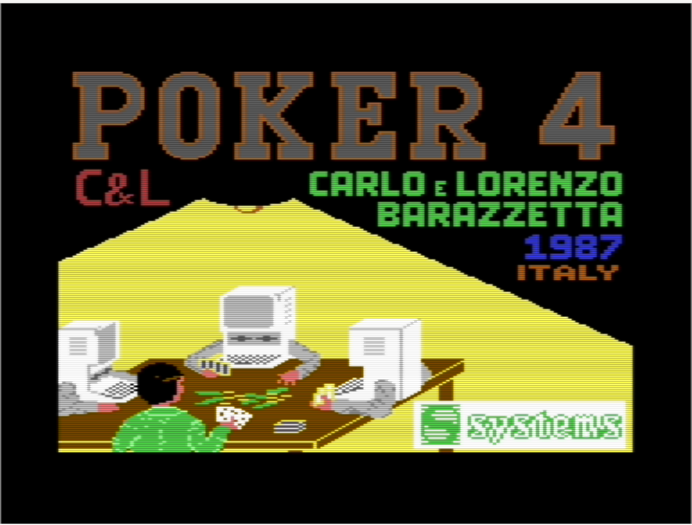

# MANUALE CARD 

# PROGRAMMA "CARD" PER COMMODORE 64 - BASIC V2

### A COSA SERVE IL PROGRAMMA "CARD"
Il programma **CARD** serve per sviluppare giochi con le carte con il Commodore 64.

Il comando CARD estende il BASIC V2 per poter stampare le carte da gioco sullo schermo.

Le carte sono visualizzate con simboli grafici ridefiniti.

E' possibile visualizzare ogni tipo di carta in ogni parte del video.

_Nell'immagine un esempio di carte da gioco stampate in modo "random" come sfondo iniziale del gioco "Briscola" scritto in Basic sfruttando il programma CARD._

Tra il 1985 e il 1987, Carlo e Lorenzo Barazzetta hanno sviluppato 3 giochi, pubblicati da Systems Editoriale:

## - Black Jack

## - Briscola

## - Poker 4

_Nell'immagine la schermata iniziale di Black Jack._

Il gioco di Poker 4 mostrava anche una "copertina" ed aveva una caratteristica unica tra i giochi di carte, ovvero la possibilità di giocare contro 3 computer, con "personalità" diverse.

In questo repository trovate i 3 file dei giochi (in formato D64) e il manuale per programmare altri giochi in BASIC.

Nella sezione ["Wiki"](https://github.com/carloBarazzetta/CARD_Games_C64/wiki) trovate il manuale online.

Buon divertimento.

### Copyright (c) 1985-2024 - Carlo & Lorenzo Barazzetta

