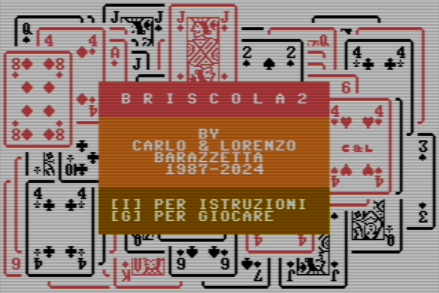

# # PROGRAMMA "CARD" PER COMMODORE 64 - BASIC V2 

---
Nel 2024, Carlo e Lorenzo Barazzetta, hanno modificato il gioco della Briscola originale e hanno prodotto il gioco Briscola 2.

Queste sono le caratteristiche aggiunte nella Briscola 2:
- il giocatore umano ed il computer, all'inizio di ogni partita, iniziano a turno a giocare la prima carta (chi inizia a giocare nella prima partita è casuale).
- modificate le istruzioni del gioco per renderle più leggibili
- modificato il codice BASIC per renderlo più leggibile
- il puntaggio finale viene mostrato per un tempo più lungo
- corretto un bug nell'IA

_Immagine iniziale del gioco "Briscola 2" scritto in BASIC sfruttando il programma CARD, partendo dal gioco "Briscola"._

## - [Briscola 2 (2024) in formato D64](./Briscola2.D64)
## - [Briscola 2 (2024) in formato Snapshop per Vice C64 Emulator](./Briscola2-vice-snapshot.vsf)
---

### A COSA SERVE IL PROGRAMMA "CARD"
Il programma **CARD** serve per sviluppare giochi con le carte con il Commodore 64.

Il comando CARD estende il BASIC V2 per poter stampare le carte da gioco sullo schermo.

Le carte sono visualizzate con simboli grafici ridefiniti.

E' possibile visualizzare ogni tipo di carta in ogni parte del video.

_Nell'immagine un esempio di carte da gioco stampate in modo "random" come sfondo iniziale del gioco "Briscola" scritto in BASIC sfruttando il programma CARD._

Nel 1985 Carlo e Lorenzo Barazzetta hanno sviluppato la libreria "CARD", con la quale hanno poi sviluppato 3 giochi, pubblicati da Systems Editoriale negli anni seguenti:

## - [Black Jack (1986) in formato D64](BlackJack.D64)
## - [Black Jack (1986) in formato Snapshop per Vice C64 Emulator](BlackJack-vice-snapshot.vsf)

## - [Briscola (1987) in formato D64](./Briscola.D64)
## - [Briscola (1987) in formato Snapshop per Vice C64 Emulator](./Briscola-vice-snapshot.vsf)

## - [Poker 4 (1987) in formato D64](./Poker4.D64)
## - [Poker 4 (1987) in formato Snapshop per Vice C64 Emulator](./Poker4-vice-snapshot.vsf)

_Nell'immagine la schermata iniziale di Black Jack._

Il gioco di Poker 4 mostrava anche una "copertina" ed aveva una caratteristica unica tra i giochi di carte, ovvero la possibilità di giocare contro 3 computer, con "personalità" diverse.

In questo repository trovate i 4 file dei giochi (in formato D64 e Snapshot per Vice C64 Emulator) e il manuale per programmare altri giochi in BASIC.

Nella sezione ["Wiki"](https://github.com/carloBarazzetta/CARD_Games_C64/wiki) trovate il manuale online.

Buon divertimento.

### Copyright (c) 1985-2024 - Carlo & Lorenzo Barazzetta

